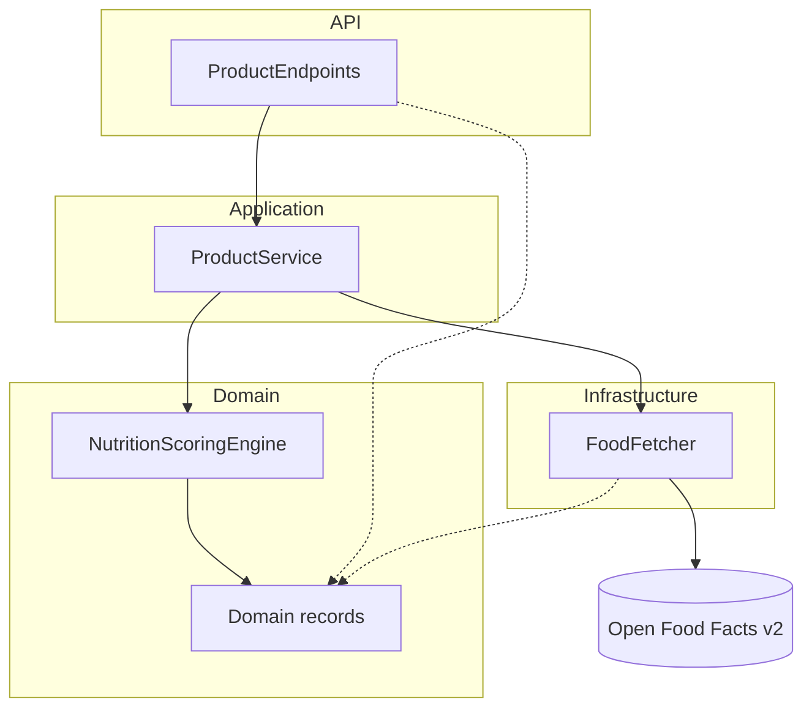
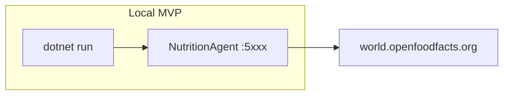

# Architecture Spine — Nutrition Intelligence Agent

## Design Paradigm

**Layered architecture** — four layers, top-down dependency only. No hexagonal ports/adapters; keep folders flat for 1–2 day scope.

| Layer | Folder | Responsibility |
| --- | --- | --- |
| **API** | `Endpoints/` | Minimal API routes, HTTP status mapping, request/response DTOs |
| **Application** | `Services/` | `ProductService` — orchestrates fetch, scoring, alternatives |
| **Domain** | `Domain/` | `NutritionScoringEngine`, enums (`HealthBand`), domain records |
| **Infrastructure** | `Infrastructure/` | `FoodFetcher` — Open Food Facts HTTP client |



## Invariants & Rules

### AD-1 — Layered dependency direction [ADOPTED]

- **Binds:** all code under `NutritionAgent/`
- **Prevents:** API calling Infrastructure directly; Domain referencing HTTP
- **Rule:** `Endpoints` → `Services` → `Domain`; `Infrastructure` → `Domain` only. Reverse references forbidden.

### AD-2 — Stateless, no persistence [ADOPTED]

- **Binds:** FR-1, FR-5, data flow
- **Prevents:** Introducing DB/cache without spine update
- **Rule:** No database, no cross-request cache. Every request fetches live from Open Food Facts.

### AD-3 — Open Food Facts API v2 only [ADOPTED]

- **Binds:** FR-1, FR-4, FR-5, `FoodFetcher`
- **Prevents:** Mixed v2/v3 clients; silent schema drift
- **Rule:** Product read: `GET /api/v2/product/{barcode}.json` on `https://world.openfoodfacts.org`. Alternatives: Search-a-licious `GET /search?q=…&nutrition_grades=…` on `https://search.openfoodfacts.org`. Product endpoint does **not** call search.

### AD-4 — Rule-based Nutrition Scoring Engine only [ADOPTED]

- **Binds:** FR-2, FR-3, FR-4, `NutritionScoringEngine`
- **Prevents:** LLM calls, Semantic Kernel, OpenAI/Azure SDKs, non-deterministic external analysis
- **Rule:** All scoring, health-band classification, insights, and alternative rationales are pure C# rules in `Domain/NutritionScoringEngine.cs`. No `OPENAI_API_KEY` or AI packages.

### AD-5 — Deterministic scoring and insights [ADOPTED]

- **Binds:** FR-2, FR-3, `NutritionScoringEngine`
- **Prevents:** Randomness, ML models, or external services in the analysis path
- **Rule:** Same nutriments input → same `nutritionScore`, `healthBand`, and `nutritionInsights`. Thresholds for sugar, saturated fat, protein, fiber, salt are constants or config — unit-tested explicitly.

### AD-6 — Response surface split [ADOPTED]

- **Binds:** FR-3, FR-4, FR-5, API contracts
- **Prevents:** `alternatives` array on `GET /products/{barcode}`
- **Rule:** Product response includes `nutritionInsights` only. Alternatives payload only on `GET /products/{barcode}/alternatives`.

### AD-7 — nutritionInsights shape [ADOPTED]

- **Binds:** FR-3, API response models
- **Prevents:** String-only insights; missing disclaimer
- **Rule:** `nutritionInsights` is `{ summary, concerns, positives, disclaimer }` — all non-empty strings on success; rule-generated content.

### AD-8 — Result pattern for errors [ADOPTED]

- **Binds:** `FoodFetcher`, `ProductService`, endpoints
- **Prevents:** Bare try/catch; thrown exceptions crossing layer boundaries unchecked
- **Rule:** Service methods return `Result<T>` (or equivalent); endpoints map to HTTP 404/502/problem details.

### AD-9 — IHttpClientFactory for external HTTP [ADOPTED]

- **Binds:** `FoodFetcher`, DI registration
- **Prevents:** `new HttpClient()` per request
- **Rule:** Named typed clients `"OpenFoodFacts"` (product) and `"OpenFoodFactsSearch"` (alternatives) registered via `IHttpClientFactory`.

### AD-10 — Separate test project [ADOPTED]

- **Binds:** FR-6, TDD workflow
- **Prevents:** Tests co-located in main project
- **Rule:** `NutritionAgent/NutritionAgent.Tests/` nested under `NutritionAgent`; references `NutritionAgent` only.

### AD-11 — Immutable DTOs as records [ADOPTED]

- **Binds:** Domain records, API response types
- **Prevents:** Mutable POCOs for outward contracts
- **Rule:** Public models use C# `record` types.

## Consistency Conventions

| Concern | Convention |
| --- | --- |
| Naming | PascalCase types/files; JSON camelCase via ASP.NET defaults; `nutriscoreGrade` in API matches OFF field naming where exposed |
| Data & formats | Barcode: string of digits; nutriments per 100g; errors: RFC 7807 problem details |
| State & cross-cutting | Async all I/O; config via `IConfiguration`/env vars; no auth middleware in MVP |
| Logging | `ILogger<T>`; log scoring thresholds applied at Debug for troubleshooting |

## Stack

| Name | Version |
| --- | --- |
| .NET | 10.0 |
| ASP.NET Core (Minimal API) | 10.0 |
| Microsoft.AspNetCore.OpenApi | 10.0.8 |
| xunit + Microsoft.AspNetCore.Mvc.Testing | `[ASSUMPTION: latest stable compatible with net10.0]` |

## Structural Seed

```text
Nutrition/
  NutritionAgent/
    Domain/
      HealthBand.cs
      Product.cs
      NutritionInsights.cs
      Alternative.cs
      NutritionScoringEngine.cs
      ScoringThresholds.cs
    Infrastructure/
      FoodFetcher.cs
      OpenFoodFactsOptions.cs
    Services/
      ProductService.cs
      Result.cs
    Endpoints/
      ProductEndpoints.cs
    Program.cs
    appsettings.json
    NutritionAgent.Tests/
      Unit/
        NutritionScoringEngineTests.cs
        ProductServiceTests.cs
      Integration/
        ProductEndpointsTests.cs
  docs/
    openapi.json          # Phase 7 output
```



## Capability → Architecture Map

| Capability / FR | Lives in | Governed by |
| --- | --- | --- |
| FR-1 Product lookup | `FoodFetcher`, `ProductEndpoints` | AD-2, AD-3, AD-8, AD-9 |
| FR-2 Score & health band | `NutritionScoringEngine` | AD-4, AD-5, AD-11 |
| FR-3 Rule-based insights | `NutritionScoringEngine` | AD-4, AD-5, AD-7 |
| FR-4 Category comparison | `NutritionScoringEngine`, `FoodFetcher` | AD-3, AD-5, AD-6 |
| FR-5 Alternatives endpoint | `FoodFetcher`, `NutritionScoringEngine`, `ProductEndpoints` | AD-3, AD-6 |
| FR-6 Docs & tests | `Program.cs`, `NutritionAgent/NutritionAgent.Tests/` | AD-10 |

## Deferred

| Item | Reason |
| --- | --- |
| Open Food Facts v3 migration | PRD post-MVP; v3 lacks structured search for FR-5 |
| Caching / rate-limit handling | Out of MVP scope |
| Authentication & API keys | Demo/local only per PRD |
| LLM / Semantic Kernel (optional v2) | Explicit non-goal; removed to avoid API costs |
| Health checks, metrics, container deploy | Interview demo; local `dotnet run` sufficient |
| Dedicated interfaces per layer | YAGNI for 1–2 days; concrete classes OK if AD-1 respected |
