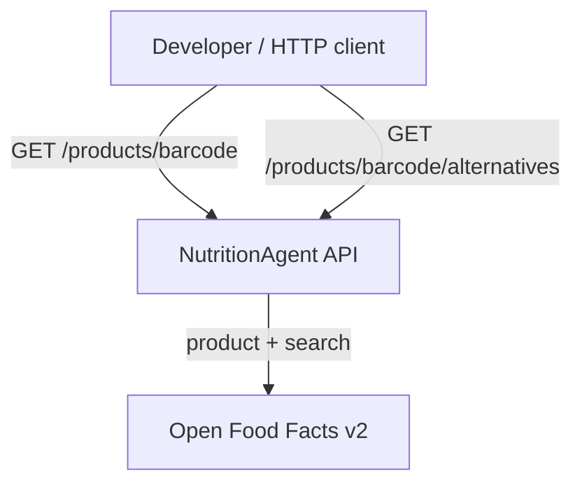

# Architecture — Nutrition Intelligence Agent

**Audience:** Interview reviewers and implementers  
**Status:** Draft (rule-based scoring engine — no LLM)  
**Companion:** `ARCHITECTURE-SPINE.md` (machine-oriented invariants)

## 1. What we're building

A **stateless .NET minimal API** that:

1. Looks up packaged food by barcode via **Open Food Facts v2**
2. Runs a **rule-based Nutrition Scoring Engine** to calculate nutrition score, classify health band, and generate insights
3. Compares product nutriments against **category averages**
4. Exposes a separate endpoint for **healthier alternatives** (better Nutri-Score, same category)

No UI, no database, no auth, **no LLM or API keys** — optimized for a **1–2 day interview assignment** with zero external AI cost.

## 2. Why this shape

| Choice | Rationale |
| --- | --- |
| **Layered** (not hexagonal) | Four clear folders; enough structure for reviewers without ports/adapters ceremony |
| **Minimal API** | PRD + workflow target; less boilerplate than controllers |
| **Rule-based engine** | Deterministic, testable, no OpenAI costs; demonstrates domain logic clearly |
| **Open Food Facts v2** | PRD decision: v2 has structured search for alternatives and category peers; v3 migration deferred |
| **Separate test project** | `NutritionAgent.Tests/` keeps TDD visible and matches workflow conventions |

## 3. System context



**External dependencies**

- **Open Food Facts** — public, no API key; optional user-agent header

## 4. Layered design

Dependencies flow **downward only** (see AD-1 in spine).

```
Endpoints/          → HTTP, status codes, OpenAPI
    ↓
Services/           → ProductService (orchestrates fetch + scoring)
    ↓
Domain/             → NutritionScoringEngine, records, HealthBand
    ↑
Infrastructure/     → FoodFetcher (OFF HTTP)
```

### 4.1 API layer (`Endpoints/ProductEndpoints.cs`)

| Route | Behavior |
| --- | --- |
| `GET /products/{barcode}` | Fetch product → score → insights + category comparison → return |
| `GET /products/{barcode}/alternatives` | Fetch source → search better Nutri-Score in category → rule-based rank/rationale |

**Important:** Product response does **not** include `alternatives` (FR-4/AD-6). Alternatives are **only** on the dedicated route.

### 4.2 Application layer

**`ProductService`** — orchestrates each request:

1. `FoodFetcher.GetProductAsync(barcode)`
2. `FoodFetcher.GetCategoryAveragesAsync(category)` (for FR-4)
3. `NutritionScoringEngine.Score(product, categoryAverages)` → `nutritionScore`, `healthBand`, `nutritionInsights`
4. For alternatives route: search OFF → `NutritionScoringEngine.RankAlternatives(source, candidates)`

### 4.3 Domain layer — Nutrition Scoring Engine

**`NutritionScoringEngine`** — pure C#, no I/O:

| Responsibility | Rules (examples) |
| --- | --- |
| **Calculate score** (0–100) | Weight sugar, saturated fat, salt negatively; protein, fiber positively |
| **Classify health band** | Score ≥ 70 → `Healthy`; 40–69 → `Moderate`; &lt; 40 → `Poor` |
| **Generate insights** | Flag high sugar, high saturated fat in `concerns`; good protein/fiber in `positives` |
| **Category comparison** | Compare each nutrient to category average; summarize in `summary` |
| **Alternative rationale** | Rule template: better Nutri-Score + lower sugar vs source |

Thresholds live in `ScoringThresholds.cs` — constants, fully unit-tested.

### 4.4 Infrastructure layer

- **`FoodFetcher`** — `IHttpClientFactory` client `"OpenFoodFacts"`
  - `GetProductAsync(barcode)` → OFF v2 product JSON
  - `SearchAlternativesAsync(category, minGrade)` → OFF v2 search
  - `GetCategoryProductsAsync(category)` → OFF v2 search for category averages

## 5. Key data contracts

### Product response (200)

```json
{
  "productName": "…",
  "brands": "…",
  "nutriments": { },
  "nutriscoreGrade": "d",
  "ingredientsText": "…",
  "nutritionScore": 32,
  "healthBand": "Poor",
  "nutritionInsights": {
    "summary": "Below category average for sugar; high saturated fat per 100g.",
    "concerns": "High sugar (18g/100g). High saturated fat (12g/100g).",
    "positives": "Good protein content (8g/100g).",
    "disclaimer": "This information is for educational purposes only and is not medical advice."
  }
}
```

### Alternatives response (200)

```json
{
  "sourceBarcode": "3017620422003",
  "alternatives": [
    {
      "barcode": "…",
      "productName": "…",
      "nutriscoreGrade": "b",
      "rationale": "Nutri-Score B vs source D; 40% less sugar per 100g."
    }
  ]
}
```

### Errors

| Condition | HTTP |
| --- | --- |
| Unknown barcode | 404 problem details |
| OFF timeout/5xx | 502 problem details |

## 6. Testing strategy

| Project | What |
| --- | --- |
| `NutritionAgent.Tests/Unit/` | `NutritionScoringEngine` — score, band, insight flags, category comparison |
| `NutritionAgent.Tests/Integration/` | WebApplicationFactory — endpoints, `nutritionInsights` shape, disclaimer |

Mandatory tests (from workflow): align 1:1 with PRD FRs — see `workflow.mdc` Phase 3.

**TDD order:** RED tests before any implementation (workflow Phase 3 → 4).

## 7. Configuration

| Variable | Required | Purpose |
| --- | --- | --- |
| `OpenFoodFacts__UserAgent` | No | OFF etiquette header |

No API keys required.

## 8. Implementation order

1. Domain records + `ScoringThresholds` + `NutritionScoringEngine`
2. `FoodFetcher`
3. `ProductService`
4. `ProductEndpoints` + `Program.cs` DI wiring

## 9. Out of scope (MVP)

- Database, caching, Kubernetes
- LLM, Semantic Kernel, OpenAI/Azure
- Authentication / rate limiting
- OFF v3 migration (documented risk in PRD §4.1)

## 10. References

- PRD: `_bmad-output/planning-artifacts/prds/prd-Nutrition-2026-06-27/prd.md`
- Spine: `ARCHITECTURE-SPINE.md` (AD-1 … AD-11)
- Workflow: `.cursor/rules/workflow.mdc`
